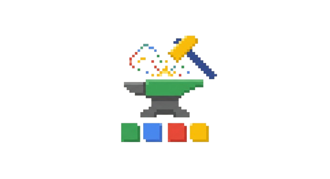

<div align="center">

</div>

<div align="center">
  A highly intelligent AI-driven sprite generation pipeline, bootstrapping entity manifestations for the <b>Daicer Project</b> (an AI Dungeon Master).
</div>

<br />

---

## ✦ What is PixelForge?

PixelForge is a purpose-built generative AI tool for creating, visualizing, and standardizing 32x32 pixel art assets. Born out of the need to rapidly prototype and generate massive amounts of visual content for **Daicer** (a fully autonomous AI-driven RPG experience), it has evolved into a fully functional "Manifestation Engine" for generating high-fidelity pixel matrices.

It leverages models like **Gemini 3.1 Pro** and **Gemini 3.1 Flash Lite** to bypass the rigidity of manual sprite illustration, interpreting high-level text descriptions directly into structured, layered pixel color arrays.

## ✦ How It Works: The Manifestation Pipeline

Generating high-quality, recognizable pixel art from a Large Language Model is a notorious challenge. PixelForge solves this through a multi-pass, highly structured architectural bridge:

### 1. The Blueprint System (Archetypes)

Instead of asking the AI to blindly "draw a goblin" or "draw a sword" and hoping for the best, PixelForge provides a spatial geometric map called a **Blueprint**.

- **Anatomy Constraints:** Each Asset Type (e.g., `Humanoid`, `Quadruped`, `Sword`) possesses a predefined 32x32 zoned matrix (e.g., `HEAD`, `TORSO`, `ARMS`, `LEGS`, or `HILT`, `BLADE`).
- **Targeted Generation:** The AI uses this grid as a skeletal framework, filling out the assigned colors while strictly adhering to the bounding boxes dictated by the archetype. You can visually edit, tweak, and resize these boundaries within the UI before generating so the model knows exactly *where* to paint!

### 2. Overlapping & Compositing (Loadouts)

A character in modern RPGs isn't just a static sprite—they acquire loot! PixelForge features a Built-in Native Compositor.

- **Multi-slot Loadouts:** Items like Swords, Shields, and Helmets are generated independently, each matching their own unique item Blueprint.
- **Layer Stacking:** Using the active blueprint anchors, PixelForge composites the item array layers directly onto the base entity's pixel grid. If your Humanoid equips the "Obsidian Greatsword," the UI visually layers the grid without overwriting the base pixels behind it in real-time.

### 3. Execution & Generative Pixels (The Engine)

The core LLM receives the prompt alongside the heavily structured blueprint array.
1. **Interpretation:** It understands the aesthetic requests (e.g., "Void energy", "Rusty iron", "Golden gleam").
2. **Matrix Painting:** It outputs a perfect 32x32 grid containing valid hexadecimal color arrays.
3. **Rendering:** The React frontend visualizes the raw multidimensional arrays using crisp-edged SVG mapping and interactive HTML canvas rendering for perfect zero-blur upscaling.

---

## ✦ Getting Started

### Local Development

This project heavily utilizes modern frontend tooling: **Vite + React + Tailwind CSS v4**

1. **Install Dependencies:**
   ```bash
   yarn install
   ```
2. **Environment Variables:**
   Ensure you have an `.env.local` config with your Gemini API key instantiated:
   ```env
   GEMINI_API_KEY=your_key_here
   ```
3. **Ignite the Forge:**
   ```bash
   yarn dev
   ```

*Powered by Google Gemini 3.1 ✨*
